# Hi, I'm Simon 👋

I'm a Software Developer from Cologne, Germany, with nearly 20 years in the industry. I love building backend services and connecting webhosting platforms using Rust and other modern technologies.

- 💻 Senior Manager @ CM4all
- 🦀 Rust enthusiast & backend specialist
- 🌍 Building platforms for some of the world's largest webhosters
- 🌱 Occasional open source contributor
- 🏊‍♂️ Into swimming, running, and cycling

## 📊 GitHub Stats

 

## 🔗 Find me online

